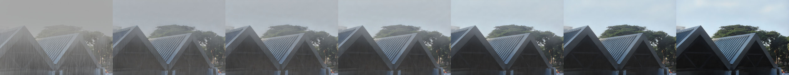
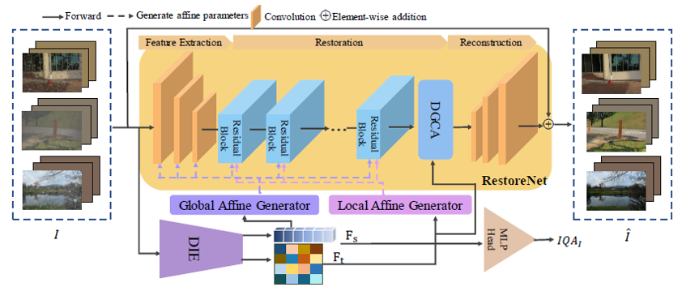

# Always Clear Days: Degradation Type and Severity Aware All-In-One Adverse Weather Removal
An official implement of the paper "Always Clear Days: Degradation Type and Severity Aware All-In-One Adverse Weather Removal"
<p align="center">
  
</p>

[[Paper](https://arxiv.org/abs/2310.18293)]

[Yu-Wei, Chen](https://fordevoted.github.io), [Soo-Chang, Pei](https://scholar.google.com/citations?user=-JiGrnAAAAAJ&hl=zh-TW)

<p align="center">
  
</p>


> **Abstract:**  All-in-one adverse weather removal is an emerging topic on image restoration, which aims to restore multiple weather degradations in an unified model, and the challenge are twofold. First, discover and handle the property of multi-domain in target distribution formed by multiple weather conditions. Second, design efficient and effective operations for different degradations. To resolve this problem, most prior works focus on the multi-domain caused by different weather types. Inspired by inter\&intra-domain adaptation literature, we observe that not only weather type but also weather severity introduce multi-domain within each weather type domain, which is ignored by previous methods, and further limit their performance. To this end, we propose a degradation type and severity aware model, called UtilityIR, for blind all-in-one bad weather image restoration. To extract weather information from single image, we propose a novel Marginal Quality Ranking Loss (MQRL) and utilize Contrastive Loss (CL) to guide weather severity and type extraction, and leverage a bag of novel techniques such as Multi-Head Cross Attention (MHCA) and Local-Global Adaptive Instance Normalization (LG-AdaIN) to efficiently restore spatial varying weather degradation. The proposed method can outperform the state-of-the-art methods subjectively and objectively on different weather removal tasks with a large margin, and enjoy less model parameters. Proposed method even can restore unseen combined multiple degradation images, and modulate restoration level.

## <a name="news"></a> 🆕 News
- **2023-10-27:** paper upload to arXiv.
- **2023-12-24:** Github repo setup. 
- **2024-03-12:** Implementation code and pre-trained weight release

## <a name="usage"></a>  💻Usage
 ### Prerequisites 
 ```
torch==1.5.1
torchvision==0.6.1
matplotlib==3.2.2
pillow==8.0.1
seaborn==0.10.1
scikit-learn==1.0
 ```
 ### Pretrained model
**[Setting 1](https://github.com/fordevoted/UtilityIR/releases/download/v1/utilityIR_setting1.pth)**, **[Setting 2](https://github.com/fordevoted/UtilityIR/releases/download/v1/utilityIR_setting2.pth)**
 ### Testing
To evaluate the model, you can pass --testing args to run different testing functions.
```
python test.py --test_dir $image_dir$ --out_dir $output_dir$ --gpu $gpu_id$
```
 ### Training
 * Modify dataset path in ``dataset.py``
 * Run the training code.
 ```
 python train.py --data_root $path_to_dataset_root$ --gpu $gpu_id$
```
**If there are any inconsistent to paper or coding bug, please feel free to raise an issue and let me know.** 

## <a name="citation"></a> 📖 Citation
If this work helps your research or work, please cite our paper
```
@article{chen2023always,
  title={Always Clear Days: Degradation Type and Severity Aware All-In-One Adverse Weather Removal},
  author={Chen, Yu-Wei and Pei, Soo-Chang},
  journal={arXiv preprint arXiv:2310.18293},
  year={2023}
}
```
### 🙏 Acknowledgements
Our code are based on [PyTorch-GAN](https://github.com/eriklindernoren/PyTorch-GAN),
  and some useful functions from
  [DLN](https://github.com/WangLiwen1994/DLN). We thank for contribution to the authors.

### 📚 Our previous work
Check out our previous work related to image restoration for adverse environment!
* Domain adaptation for underwater image enhancement:  [UIESS](https://github.com/fordevoted/UIESS),

## <a name="license"></a> 📜 License
This project is released under [Apache 2.0 license](LICENSE)


## <a name="contact"></a> ✉️ Contact
Please free free let me know if you have any questions about this work by opening an issue or mail `210509fssh@gmail.com` `r09942066@ntu.edu.tw`
